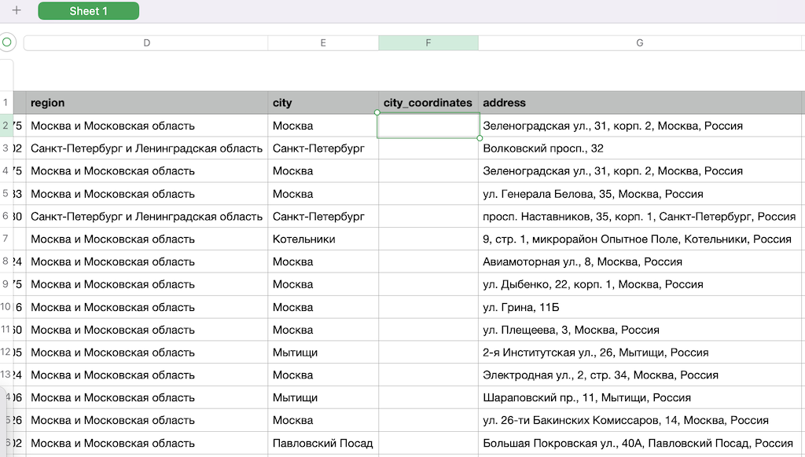

# City coordinates

## Task description

We have a file centers_demo.csv, with a list of service centers. The city column is the name of the city, the city_coords column should contain the coordinates of the city, but they are not there.

It is necessary to write a script that will go through each line, make an HTTP request to the geocoder API, pass the name of the city, get its coordinates and write them in the appropriate column.

**Note**: the cities in the table are repeated, it is necessary to optimize the code so as not to use the geocoder API to get the coordinates of the same city.